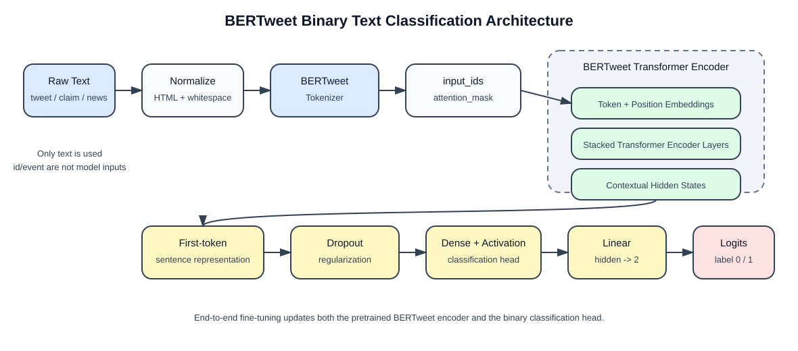
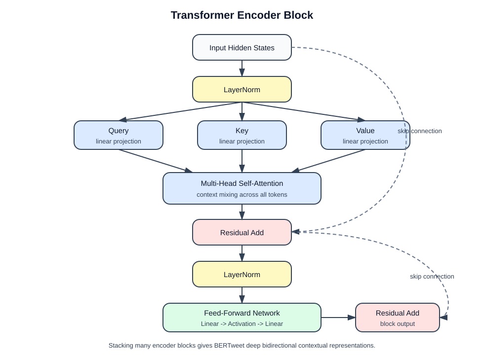

# BERTweet 模型架构技术报告

## 1. 任务背景

本项目的目标是训练一个文本二分类模型：

```text
输入：text
输出：label 0 或 1
```

数据主要来自社交媒体短文本、事实核查声明和新闻类文本。模型需要判断文本更接近真实信息还是虚假/谣言信息。由于原始训练集规模较小，直接从零训练 TextCNN、LSTM 或 Transformer 容易过拟合，因此本项目采用预训练语言模型 BERTweet 进行微调。

## 2. 为什么选择 BERTweet

BERTweet 是面向英文 Twitter 文本预训练的 Transformer Encoder 模型。它的底层结构与 RoBERTa-base 类似，但预训练语料来自大规模英文推文，因此比普通 BERT/RoBERTa 更适合处理社交媒体文本。

该任务与 BERTweet 的匹配点主要有四个：

1. **文本风格匹配**

   原始数据中大量文本包含 URL、hashtag、mention、缩写、口语表达和非正式语法。BERTweet 在推文语料上预训练，天然更熟悉这类语言形式。

2. **小样本友好**

   当前主训练集规模较小。BERTweet 已经学习了大量通用语言表示，微调时只需要让模型适配本任务的 label 边界，不需要从零学习语言特征。

3. **双向上下文建模**

   虚假信息识别通常依赖整句话或整段文本中的上下文关系。Transformer Encoder 的 self-attention 可以让每个 token 同时关注上下文中的所有 token。

4. **适合二分类微调**

   BERTweet 可以通过一个轻量分类头直接转换为二分类模型。训练时既可以微调整个 encoder，也可以只训练分类头。本项目采用端到端微调，即 encoder 和分类头都会更新。

## 3. 整体模型结构

本项目使用 `vinai/bertweet-base` 作为预训练基座，并通过 `AutoModelForSequenceClassification` 添加二分类头。

整体流程如下：



简化后可以表示为：

```text
text
  -> BERTweet tokenizer
  -> BERTweet Transformer encoder
  -> classification head
  -> logits for label 0 and label 1
```

其中：

- `label 0`：真实/支持类信息
- `label 1`：虚假/反驳类信息

具体标签含义由数据集映射决定。例如 GossipCop 中 `R -> 0`、`F -> 1`，FEVER/shared task 中 `SUPPORTS -> 0`、`REFUTES -> 1`。

## 4. BERTweet Encoder 架构

BERTweet base 采用 Transformer Encoder 架构。它不是自回归生成模型，而是双向编码模型。也就是说，模型在编码某个 token 时，可以同时利用该 token 左右两侧的上下文。

典型 base 级别结构为：

```text
Embedding Layer
  -> Transformer Encoder Layer 1
  -> Transformer Encoder Layer 2
  -> ...
  -> Transformer Encoder Layer N
  -> Contextual token representations
```

每一层 Transformer Encoder 都包含两个核心模块：

1. Multi-Head Self-Attention
2. Feed-Forward Network

并配合残差连接与 Layer Normalization。

## 5. Transformer Encoder Block

单个 Transformer Encoder Block 的结构如下：



### 5.1 Self-Attention

Self-attention 的作用是为每个 token 动态聚合上下文信息。对于一句文本中的每个 token，模型会计算它与其他 token 的相关性，然后根据相关性加权汇总上下文。

例如：

```text
"Breaking news: ..."
"rumor says ..."
"police confirms ..."
```

这些短语对真假判断的贡献不同。Self-attention 可以让模型自动学习哪些词、短语或上下文组合更重要。

### 5.2 Multi-Head 机制

Multi-head attention 会并行学习多组注意力模式。不同 attention head 可能关注不同信息：

- 实体关系
- 否定词
- 情绪化表达
- 来源可信度相关词
- 时间、地点、事件描述
- hashtag 或社交媒体表达

这比单一注意力头更适合处理复杂文本信号。

### 5.3 Feed-Forward Network

Self-attention 负责 token 之间的信息交互，Feed-Forward Network 负责对每个 token 的表示进行非线性变换。它增强了模型表达能力，使模型不仅能聚合上下文，还能学习更复杂的语义特征。

### 5.4 Residual 和 LayerNorm

残差连接和 LayerNorm 让深层 Transformer 更容易训练：

- 残差连接保留原始信息，缓解梯度消失
- LayerNorm 稳定不同层之间的数值分布
- Dropout 减少过拟合

这些设计对小数据微调尤其重要。

## 6. Tokenizer 与输入表示

BERTweet 的 tokenizer 会将原始文本切分为子词 token。对社交媒体文本来说，子词建模非常关键，因为推文中经常出现：

- hashtag：`#Ferguson`
- mention：`@username`
- URL
- 缩写
- 拼写变化
- 未登录词

子词 tokenization 可以把未见过的词拆成可处理的片段，从而减少 OOV 问题。

模型输入通常包括：

```text
input_ids
attention_mask
```

其中：

- `input_ids` 表示 token 对应的词表编号
- `attention_mask` 表示哪些位置是真实 token，哪些位置是 padding

本项目配置中使用：

```yaml
max_length: 128
```

这适合原始推文类短文本。对于 GossipCop 这类较长文本，输入会被截断。因此清洗脚本把 `title`、`description` 放在正文前面，尽量让更高信息密度的内容保留在前 128 个 token 内。

## 7. 分类头设计

在二分类任务中，Transformer Encoder 会输出每个 token 的上下文表示。分类时通常取第一个特殊 token 的表示作为整段文本的摘要表示，然后输入分类头。

分类头可以抽象为：

```text
first-token hidden state
  -> dropout
  -> dense layer
  -> activation
  -> dropout
  -> linear layer
  -> logits for 2 classes
```

输出 logits 的形状为：

```text
[batch_size, 2]
```

训练时使用 Cross Entropy Loss。预测时通常取：

```text
argmax(logits)
```

得到最终标签。

## 8. 微调方式

本项目采用端到端微调：

```text
BERTweet encoder parameters: updated
classification head parameters: updated
```

这种方式比只训练分类头更灵活。分类头只负责把已有表示映射到标签，而端到端微调可以让 encoder 的语义表示也向本任务靠拢。

在当前任务中，这一点很重要，因为真假/谣言识别不只是普通情感或主题分类，还依赖文本中的事实性、表达方式、事件描述和社交媒体语境。

## 9. 与本任务的匹配性分析

### 9.1 原始推文数据

原始训练集是短文本，且包含大量 hashtag、URL 和事件关键词。BERTweet 的预训练语料与这种数据风格高度一致，因此能更好地处理推文语言。

### 9.2 公开额外数据

额外数据包括：

- GossipCop：新闻/娱乐谣言数据
- shared task / FEVER 风格数据：事实核查 claim 数据

这些数据与原始推文不是完全同分布，但它们提供了更丰富的真假判断样本。加入额外数据后，模型可能学习到更一般的事实性判断模式，而不只是记住原始事件关键词。

需要注意的是，额外数据分布差异较大，可能带来 domain shift。因此训练结果需要以验证集指标为准，并观察是否出现过拟合或偏向某一类标签。

### 9.3 小数据场景

在小数据场景下，预训练模型的优势明显：

```text
少量标注数据
  + 大规模预训练语言知识
  -> 更稳健的文本表示
```

这也是本项目选择 BERTweet 微调，而不是从零训练神经网络的主要原因。

## 10. 总结

BERTweet 的核心优势在于：

- Transformer Encoder 能建模双向上下文
- Multi-head self-attention 能捕捉多种文本信号
- 推文语料预训练使其适合社交媒体短文本
- 预训练表示降低小样本训练难度
- 二分类头可以自然适配真假/谣言检测任务

因此，BERTweet 与本项目的文本二分类任务具有较高匹配度。它既能利用预训练模型的语言理解能力，又能通过微调适配当前数据集中的 `label 0 / label 1` 判别边界。
